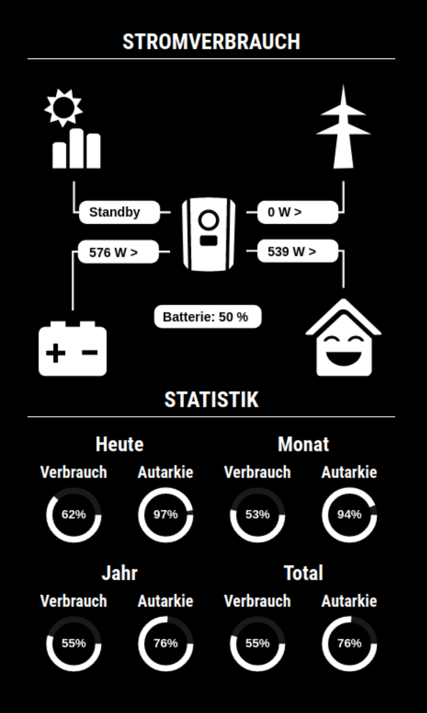

# MMM-Plenticore

**Codebase from <https://github.com/pixcept/ioBroker.plenticore>**

This is a module for the [MagicMirror²](https://github.com/MichMich/MagicMirror/). The module connects to the API of the KOSTAL Plenticore inverter and reads the current data and brings it to the output.

## Installation

Navigate into your MagicMirror's `modules` folder and run:

```bash
git clone https://github.com/eckonator/MMM-Plenticore
```

## Using the module

To use this module, add the following configuration block to the modules array in the `config/config.js` file:

```js
        {
            module: 'MMM-Plenticore',
            config: {
                ipaddress: "192.168.178.xxx",
                port: "80",
                https: false,
                password: "",
                pollinterval: 20000,
                showStats: true,
                runOwnJsonApiServerInLocalNetwork: false,
                ownJsonApiServerPort: 4000,
                debugMode: false
            }
        },
```

## Building from TypeScript source

Todo...

## Screenshot


